# Detection of mildew on cherry leaves

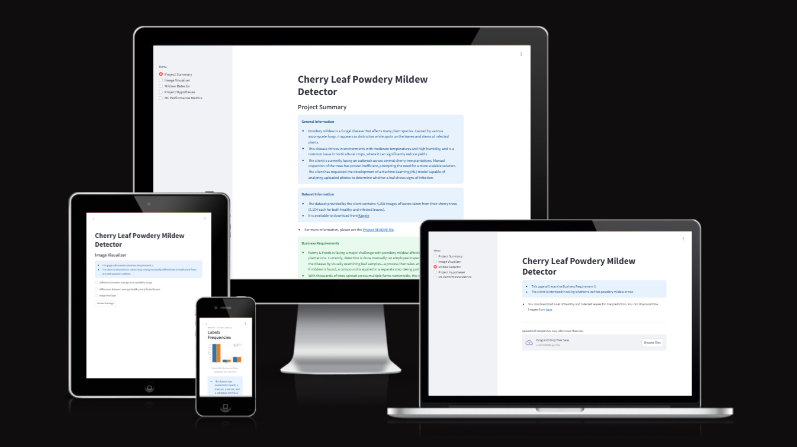

## Contents

- [Detection of mildew on cherry leaves](#detection-of-mildew-on-cherry-leaves)
  - [Contents](#contents)
  - [Introduction](#introduction)
  - [Dataset Content](#dataset-content)
  - [Business Requirements](#business-requirements)
  - [Hypothesis and how to validate?](#hypothesis-and-how-to-validate)
  - [The rationale to map the business requirements to the Data Visualisations and ML tasks](#the-rationale-to-map-the-business-requirements-to-the-data-visualisations-and-ml-tasks)
  - [ML Business Case](#ml-business-case)
  - [Dashboard Design](#dashboard-design)
  - [Unfixed Bugs](#unfixed-bugs)
  - [Deployment](#deployment)
    - [Render](#render)
  - [Main Data Analysis and Machine Learning Libraries](#main-data-analysis-and-machine-learning-libraries)
    - [Other technologies used](#other-technologies-used)
  - [Issues](#issues)
  - [Testing](#testing)
    - [Manual Testing](#manual-testing)
    - [Python Validation](#python-validation)
  - [Credits](#credits)
    - [Content](#content)
  - [Acknowledgement](#acknowledgement)

## Introduction

Cherrypicker is a data science and machine learning (ML) project focused on using predictive analytics to distinguish between two classes of leaf images: healthy and infected.

The project is designed to support an agri-food business currently facing an outbreak of powdery mildew in its cherry tree plantations. At present, identifying infected trees is done manually—a process that is both time-consuming and labour-intensive.

To address this, we propose developing an ML model capable of detecting powdery mildew from photographs of cherry tree leaves. This solution aims to streamline the inspection process, reduce operational workload, and improve the speed and accuracy of treatment decisions, ultimately supporting more effective disease management.

The project is hosted on the streamlit app and a live version may be found [here](https://project-5-mildew-detection.onrender.com/)

## Dataset Content

- The dataset is sourced from [Kaggle](https://www.kaggle.com/codeinstitute/cherry-leaves). We then created a fictitious user story where predictive analytics can be applied in a real project in the workplace.
- The dataset contains +4 thousand images taken from the client's crop fields. The images show healthy cherry leaves and cherry leaves that have powdery mildew, a fungal disease that affects many plant species. The cherry plantation crop is one of the finest products in their portfolio, and the company is concerned about supplying the market with a compromised quality product.

## Business Requirements

The cherry plantation crop from Farmy & Foods is facing a challenge where their cherry plantations have been presenting powdery mildew. Currently, the process is manual verification if a given cherry tree contains powdery mildew. An employee spends around 30 minutes in each tree, taking a few samples of tree leaves and verifying visually if the leaf tree is healthy or has powdery mildew. If there is powdery mildew, the employee applies a specific compound to kill the fungus. The time spent applying this compound is 1 minute. The company has thousands of cherry trees located on multiple farms across the country. As a result, this manual process is not scalable due to the time spent in the manual process inspection.

To save time in this process, the IT team suggested an ML system that detects instantly, using a leaf tree image, if it is healthy or has powdery mildew. A similar manual process is in place for other crops for detecting pests, and if this initiative is successful, there is a realistic chance to replicate this project for all other crops. The dataset is a collection of cherry leaf images provided by Farmy & Foods, taken from their crops.

- 1 - The client is interested in conducting a study to visually differentiate a healthy cherry leaf from one with powdery mildew.
- 2 - The client is interested in predicting if a cherry leaf is healthy or contains powdery mildew.

## Hypothesis and how to validate?

Hypothesis 🧠: Cherry leaves affected by powdery mildew exhibit consistent visual features that can be detected and accurately classified by a machine learning model.

---

Validation Strategy ✅:

- Step 1: Visual Analysis

    To assess whether visual differences exist between healthy and infected leaves, average and variability images were generated for each class. These helped confirm the hypothesis that consistent patterns are visible and could be leveraged by a machine learning model.

    The below images show a selection of healthy leaves:

    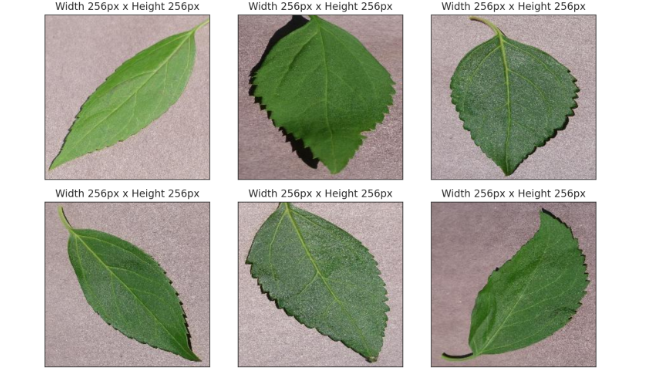

    And leaves where powdery mildew is present:

    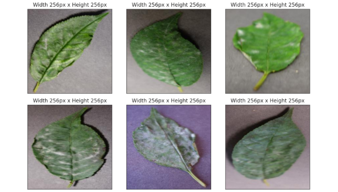

    To generate the average and variability images used for validation, sample images (like those shown above) were loaded into an array after determining their dimensions. A custom function was then used to compute and visualize the mean and variability across the dataset. Below are the resulting average and variability images for both healthy and infected leaves.

    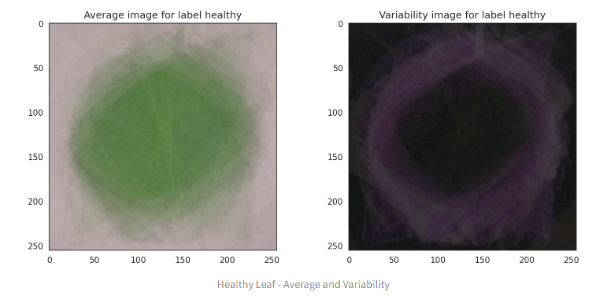

    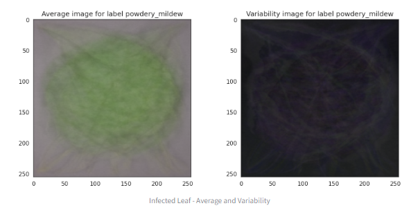

    From the photographs and results of the analysis, it appears that the hypothesis is correct and there is a visual difference. We may therefore consider the hypothesis validated.

- Step 2: Model Training

    A Convolutional Neural Network (CNN) was trained on a labeled dataset of cherry leaf images. The model was designed to learn and classify features that distinguish healthy from infected leaves.

- Step 3: Performance Evaluation

    The model’s performance was assessed using a combination of classification metrics and training diagnostics to ensure both accuracy and generalization.

    ✅ Metrics Used:

    - Overall Accuracy

    - Confusion Matrix
  
    - Precision, Recall, and F1-Score (per class)

    These metrics helped evaluate not only how often the model was correct, but how well it distinguished between healthy and infected leaves under different conditions.

    📈 Training & Validation Performance

    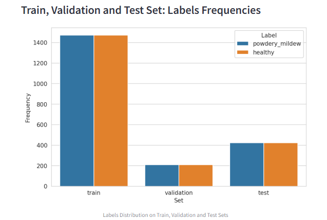

    Training and validation accuracy over epochs.

    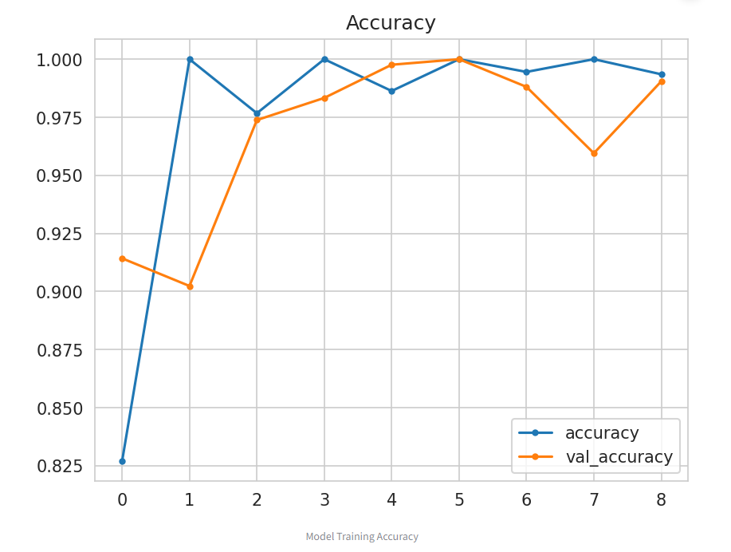

    Training and validation loss over epochs.

    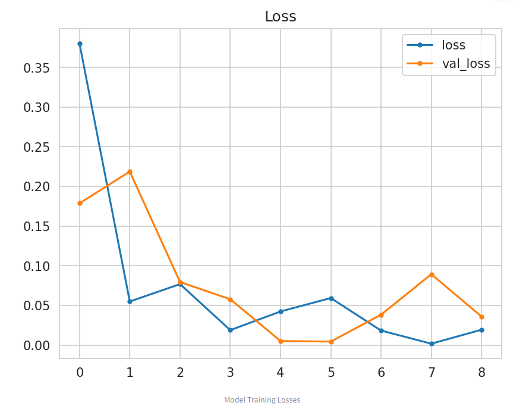

    These graphs show that the model learned effectively, with minimal overfitting and consistent improvement across epochs.

- Step 4: Deployment & Testing

    The final model was deployed within a Streamlit dashboard, allowing users to upload new leaf images and receive real-time predictions. This ensured practical, real-world usability for the client.

    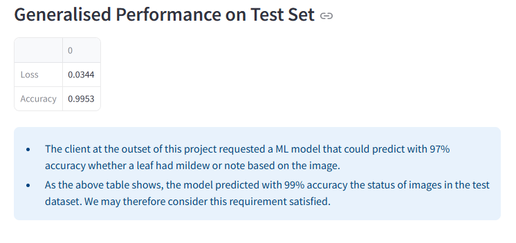

    - Target prediction accuracy: ≥ 97% 🎯

## The rationale to map the business requirements to the Data Visualisations and ML tasks

| Business Requirement                  | ML/Visualisation Task                                               | Rationale                                                |
| ------------------------------------- | ------------------------------------------------------------------- | -------------------------------------------------------- |
| Visual differentiation of leaf health | Create average, variability, and difference images + image montages | Provides insight into common visual traits of each class |
| Predict mildew presence               | Train binary classification CNN                                     | Automates detection with scalable performance            |
| Usability via dashboard               | Streamlit dashboard with upload & prediction                        | Ensures non-technical users can access results easily    |

## ML Business Case

Problem: Visual inspection of leaves is time-consuming, error-prone, and unscalable.

Solution: A Convolutional Neural Network (CNN) trained on cherry leaf images can classify leaves as “Healthy” or “Powdery Mildew” instantly.

Benefits:

- Reduces inspection time from 30 minutes to seconds

- Enhances crop quality assurance

- Scalable to other crops and use cases

- Performance Metric: Must achieve at least 97% accuracy to be considered successful by the client.

## Dashboard Design

The dashboard was made using Streamlit and has been designed with clarity and ease of use in mind. It contains the following pages:

1. Project Summary

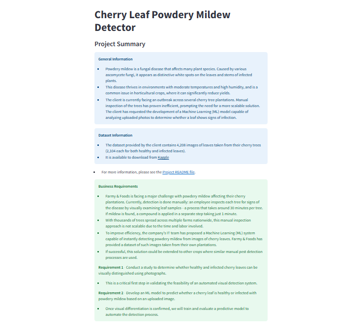

This is the introductory page the user will see on accessing the dashboard. Its intended purpose is to provide a new user with essential information both general and specific, so that they may gain a full understanding of the project before proceeding to more technical pages. It contains the following:

- General Information
- Dataset Information
- Link to project README
- Business Requirements

2. Image Visualizer

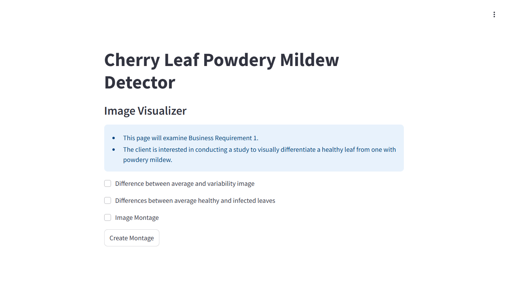

This page contains the following:

- Business requirement 1
- Checkbox 1 - Difference between average and variability image
- Checkbox 2 - Differences between average healthy and average infected leaves
- Checkbox 3 - Image Montage

This page is intended to answer buiness requirement 1: The client is interested in conducting a study to visually differentiate a healthy cherry leaf from one with powdery mildew.

3. Mildew Detector

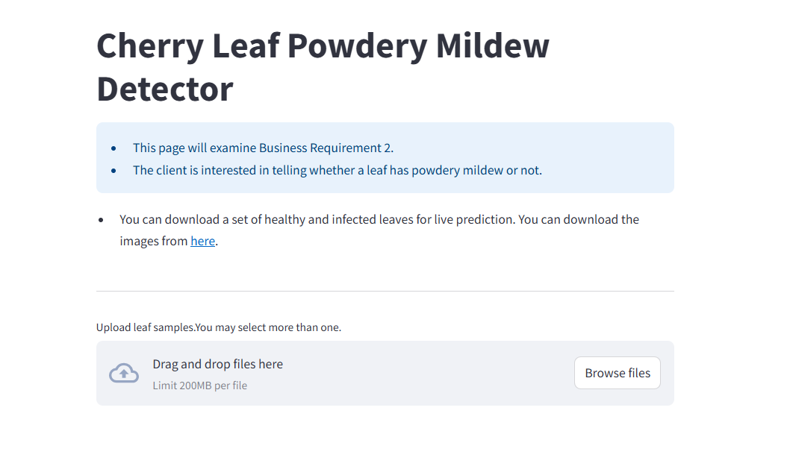

This page contains the following:

- Business requirement 2
- Link to Kaggle dataset
- Widget to upload images for analysis
- Link to download report in .csv format

This page answers business requirement 2: The client is interested in predicting if a cherry leaf is healthy or contains powdery mildew.

4. Project Hypotheses

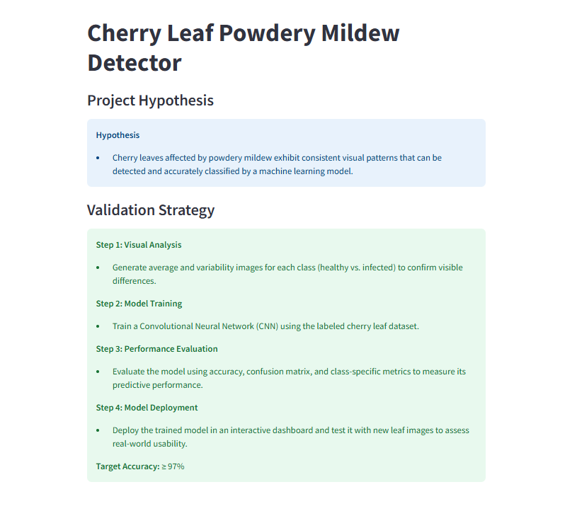

This page contains the following:

- Project Hypotheses
- Validation

This page displays the project hypotheses and explaines the method by which they were validated

5. Performance Metrics

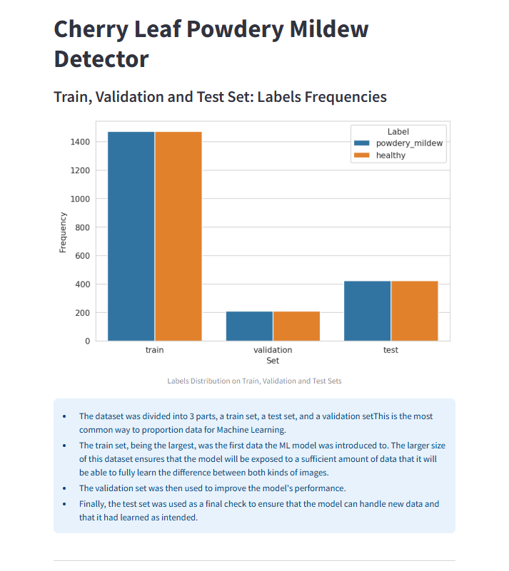
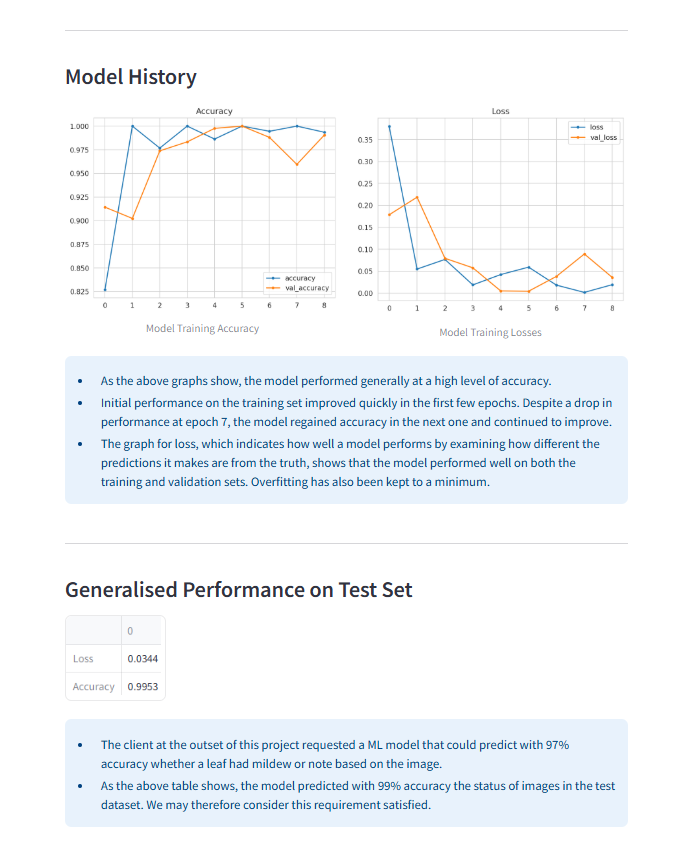

This page contains the following:

- Train, Validation and Test Set: Labels Frequencies
- Model History
- Generalised Performance on test set

This page shows the results of our analysis.The page explains how the dataset was used for testing purposes. It also shows the results of the ML model training, including graphics to show model accuracy and loss on the training and validation set, and an explanation of the graphs. It also shows how the model performed on the test set after it had been trained, and explains what that means for the business requirements.

## Unfixed Bugs

There are no unfixed bugs

## Deployment

### Render

- The App live link is: `https://project-5-mildew-detection.onrender.com/`

## Main Data Analysis and Machine Learning Libraries

- numpy==1.26.4 - used to convert information to arrays
- pandas==2.1.1 - used for converting information to a dataframe and saving as such
- matplotlib==3.8.0 - used to plot the distribution of datasets
- seaborn==0.13.2 - used for making statistical graphics
- plotly==5.17.0 - used for plotting results of ML model training
- Pillow==10.0.1 - used to adjust images
- streamlit==1.40.2 - used to create the dashboard's interface
- joblib==1.4.2 - used for runnning tasks in parallel
- scikit-learn==1.3.1 - used for model evaluation
- tensorflow-cpu==2.15.0 - used for model creation

### Other technologies used

- Streamlit - used for dashboard development to present data and for final project delivery

- Render - used to deploy the project as a web app.

- Git/GitHub - used for version control and code storage

- Jupyter Notebooks - IDE used to develop the project

- Am I responsive - used to produce screenshot of the project.

## Issues

During deployment, the app exceeded the size limit imposed by the hosting platform (Render). Despite efforts to reduce the size by adding unnecessary files and folders to .slugignore, the project remained too large to deploy successfully.

To resolve this, the following adjustment was made:

Downgraded Python version from 3.12 to 3.11 to reduce dependency bloat and ensure compatibility with smaller library builds.

## Testing

### Manual Testing

*Business Requirements Testing*

**Requirement 1** - The client is interested in conducting a study to visually differentiate a healthy cherry leaf from one with powdery mildew.

- As an end user, I can review a page of project findings so that I can receive more detailed information on what conclusions the development team came to.

| Dashboard item | Test conducted | Expected result | Actual result |
| -- | -- | -- | -- |
| Navbar | Selecting button for Image Visualiser | Image Visualiser page opens | Success |
| Button for difference between average & variability image | Click button | Display average & variability image for healthy & infected leaves | Success |
| Button for difference between average healthy & infect leaves | Click button | Display both average images & difference image for average healthy & infect leaves | Success |
| Button for image montage | Click button | Display dropdown for montage creation | Success |
| Dropdown option for healthy leaves | Select & click button to create montage | See montage of healthy leaves| Success |
| Dropdown option for infected leaves | Select & click button to create montage | See montage of infected leaves| Success |

- As an end user I can view a page detailing the project hypothesis so that I can understand the reasoning behind the developer's analysis

| Dashboard item | Test conducted | Expected result | Actual result |
| -- | -- | -- | -- |
| Navbar | Selecting button for Project Hypotheses | Project Hypothesis page opens | Success |

**Requirement 2** - The client is interested in predicting if a cherry leaf is healthy or contains powdery mildew.

The client wanted a dashboard that would let them upload images of leaves to the site and have an accurate reading of whether they were healthy or sick. This requirement was considered in the below user story:

- As an end user I can upload an image of a leaf so that I can learn if it is diseased or not. 

| Dashboard item | Test conducted | Expected result | Actual result |
| -- | -- | -- | -- |
| Navbar | Selecting button for Mildew Detector |Mildew Detector page opens | Success |
| Link to Kaggle on Mildew Detector page | Click on link |Kaggle page for dataset opens | Success |
| Box for uploading data | Drag & drop leaf image into box | See report displaying analysis of the image | Success |
| Box for uploading data | Use browse files button | File explorer opens to enable selection | Success |
| Box for uploading data | Upload image from file explorer | See report displaying analysis of the image | Success |
| Box for uploading data | Repeat prior two items for multiple images | See report displaying analysis of all the images| Success |
| Image analysis report | Click button to download csv report of analysis | Report is downloaded containing the results shown on dashboard| Success |

### Python Validation

The python code for the app pages and files for data management and predictive analysis was validated using a [PEP8 linter](https://pep8ci.herokuapp.com/).

## Credits

### Content

- Project idea and structure provided by Code Institute Portfolio 5: Predictive Analytics brief.

- The dataset was created by Code institute and taken from Kaggle
  
- The Malaria Walkthrough Project from Code Institute was used as a guide when assembling this project.

## Acknowledgement

- I would like to acknowledge my mentor, Mo Shami, who provided valuable insights and guidance during the project. I would also like to thank the Slack community and Tutor Support, who helped with technical issues.

[Back to top](#contents)
